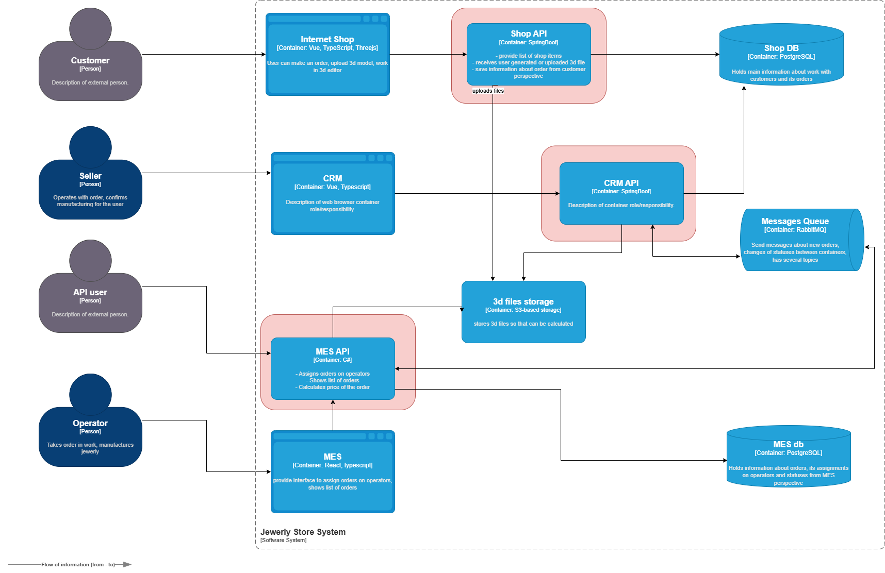
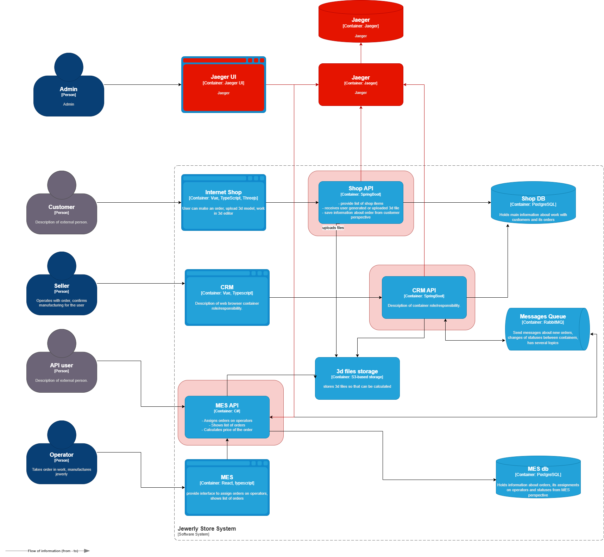
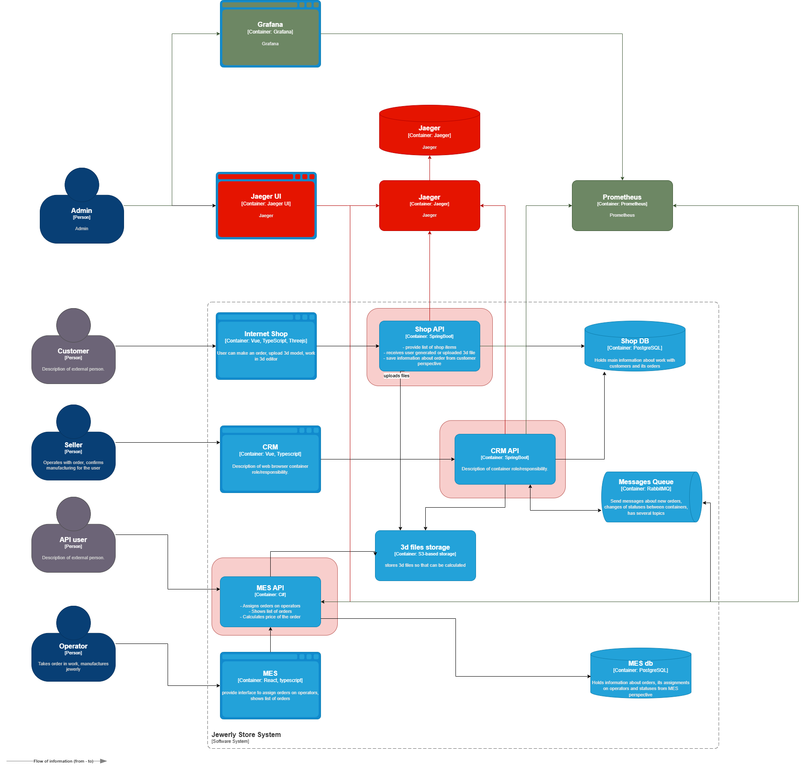
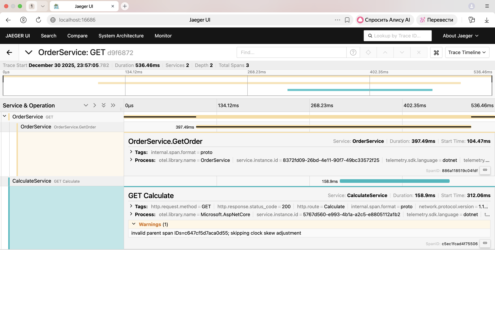

# Проанализируйте систему компании и C4-диаграмму в контексте планирования трейсинга. 

Напишите и выделите на схеме системы, которые следует покрыть трейсингом. Для этого идентифицируйте места, где заказ может «сломаться» или зависнуть.

# Мотивация
1. Прозрачность процесса.
2. Сокращает время на локализацию и решение инцидента. Будет сквозной путь заказа.
3. Контроль передачи сообщений между сервисами.
4. Снижает репутационные риски.
5. Снижает количество жалоб клиентов.

## Технические и бизнес‑метрики:
1. Время от обнаружения проблемы до её устранения.
2. Order Duration -- время выполнения заказа.
3. Error Rate by Service -- количество ошибок в сервисе.

## Данные для трейсинга:
* trace_id - уникальный идентификатор трейса (сквозной для всего пути заказа);
* order_id
* user_id
* service_name - название сервиса
* status
* error_message

# Предлагаемое решение

# Компромиссы
1. Проприетарные системы — если нельзя внедрить OTel SDK (требуется API‑интеграция).
2. Legacy‑системы — отсутствие поддержки современных протоколов (требуется обвязка).
3. Внедрение новой технологии потребует обучения от команды.
4. Вндрение новой технологии займет время - 3 месяца.

# Безопасность
1. Аутентификация (Использовать AD).
2. Шифрование (TLS).
3. Максировка данных (пароли, платежная информация, ФИО).
4. Аудит доступа.

# Дополнительное задание. 
Спроектируйте и опишите в разделе «Предлагаемое решение», как будет реализованы автоматический мониторинг процесса прохождения заказа, полученные из данных трейсинга, и алертинг. Обновите последний вариант диаграммы, который вы подготовили для этого раздела, — отразите на нём необходимые связи. Новые элементы выделяйте зелёным цветом. Добавьте отдельную ссылку на новый вариант диаграммы.

