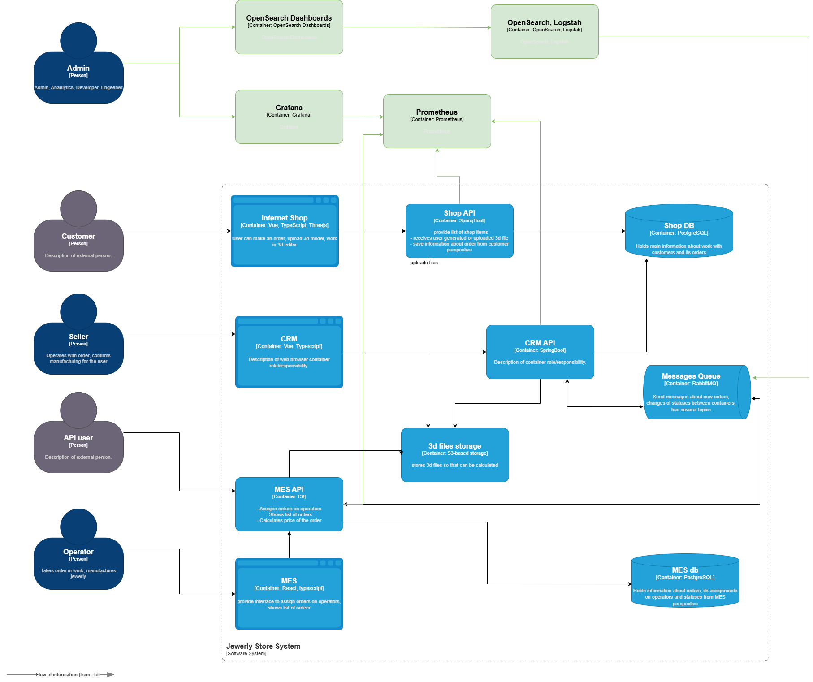

# 1.
# 2. Проанализируйте систему компании и C4-диаграмму в контексте планирования логирования.

## Уровень INFO
#### Internet Shop и Shop API
* Создание заказа: timestamp, user_id, order_id, order_status.
* Загрузка 3D-модели: timestamp, user_id, order_id, file_id, file_size
#### CRM
* Начало расчета стоимости: timestamp, order_id, polygons_count.
* Завершение расчета стоимости: timestamp, order_id, total_price, duration.
* Смена статуса производства: timestamp, order_id, status.
* Назначение оператора: teimestamp, order_id, operator_id.
#### RabbitMQ:
* Отправка сообщения (timestamp, queue_name, message_id).
* Получение сообщения (timestamp, queue_name, message_id, consumer_id).

## Уровни логирования
INFO: стандартные операции.
WARN: повторные отправки сообщений.
ERROR: HTTP 5xx, ошибки БД, timeout.

# 3. Мотивация
1. Снижение времени разбора инцидентов.
2. Оперативное реагирование на инциденты.
3. Своевременное обнаружение аномалий в системе.
## Технические и бизнес‑метрики:

1. MTTR (Mean Time to Resolve) — время от обнаружения проблемы до её устранения.
2. Количество жалоб клиентов — снижение за счёт раннего выявления проблем.
3. Загрузка поддержки — число обращений в час/день.
4. Доступность сервиса (uptime) — процент времени безотказной работы.
5. Скорость расследования инцидентов — время от алерта до диагноза.

## Первый этап (критически важные системы):

1. MES — ядро системы (расчет стоимости и отправка на производство); сбои напрямую влияют на заказы.
2. CRM — точка взаимодействия с клиентами; ошибки ведут к жалобам.
3. RabbitMQ — интеграционный слой; задержки блокируют процессы.

### Обоснование
* эти системы образуют сквозной процесс «заказ → расчёт → производство»;
* логи из них покрывают 80 % инцидентов;
* быстрое внедрение даст максимальный ROI.

## 4. Предлагаемое решение

Технологии:

1. Агрегация и обработка: Logstash (фильтрация, обогащение).
2. Хранение и поиск: OpenSearch (аналог Elasticsearch, лицензия Apache 2.0).
3. Визуализация: OpenSearch Dashboards (аналог Kibana).
4. Алерты: OpenSearch Alerting.

## Проработайте политику безопасности в отношении логов
### Чувствительные данные
1. Персональные данные (email, ФИО) — маскировать в логах;
2. Платёжная информация — не логировать;
3. ID заказов/пользователей — разрешены, но без привязки к персональным данным.

## Доступ к логам

* Админы — полный доступ.
* Разработчики/системные аналитики — доступ к техническим логам (без персональных данных).
* Поддержка — доступ к логам ошибок и статусов заказов.

## Проработайте политику хранения в отношении логов
* Индексы: отдельные для каждой системы
* Срок хранения: 30 дней

## 5. Проработайте необходимые мероприятия для превращения системы сбора логов в систему анализа логов:
Алерты (настройка в OpenSearch):

* HTTP 500 > 5 за 1 мин в любом сервисе;
* задержка RabbitMQ > 1 мин;
* аномальный рост числа заказов (> 10× от среднего за 1 час).

## 6. Дополнительное задание. 

Критерий      | ELK         | OpenSearch  | Splunk      |
|-------------|-------------|-------------|-------------|
|Лицензия | Elastic License| Apache License, Version 2.0 |Проприетарная	
|Масштабируемость| Высокая | Высокая | Очень высокая |
| Стоимость | Средняя |Низкая (open‑source)| Высокая
|Порог вхождение для команды| Средний | Средний. Аналог ELK. | Высокий
|Алерты | Через Kibana | Встроенные | Мощные
|Поддержка сообщества| Активное | Активное | Корпоративная

Обоснование выбора OpenSearch:
* Apache 2.0 разрешает коммерческое использование без ограничений.
* Аналогичен Elasticsearch, поэтому команда быстро адаптируется.
* Встроенные алерты и Dashboards покрывают базовые нужды.