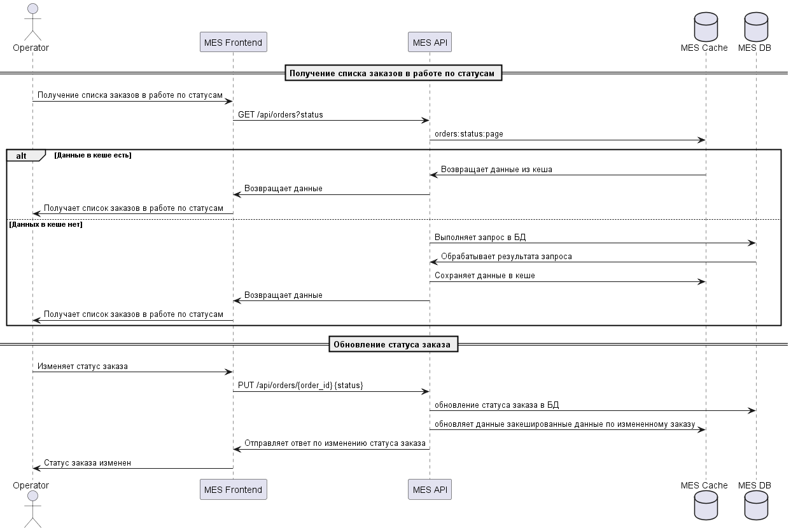

# Контекст

MES чувствует себя не очень хорошо. Операторы жалуются на низкую скорость работы со страницей, а новых клиентов не устраивает скорость выполнения заказа. Руководство «Александрита» просит вас разобраться с проблемой.
Вам нужно подготовить документ с описанием вашего архитектурного решения. Он поможет вам объяснить бизнесу и разработчикам, что нужно сделать, чтобы решить проблему. 

# Мотивация
### Проблема
Участились жалобы от операторов: когда они заходят на первую страницу MES, система долго прогружается. На первой странице отображается список заказов в работе по статусам — это дашборд с фильтром. Раньше страница показывала все заказы, но это тормозило загрузку. Команда сделала фильтр по статусам и пагинацию, но это не помогло. Операторам важно видеть самые новые заказы, потому что от этого зависит их вознаграждение, — кто взял заказ, тот и получит оплату.

Кеширование значительно повысит производительность работы при формировании списка заказов по стаустам.

# Предлагаемое решение

Будем внедрять серверное кеширование 
### Обоснование выбора Cache-Aside:
* Простата реализации.
* Гибкость в управлении срока жизни данных в кеше TTL.
* Низкая нагрузка на кеш (данные попадают при заппосе).

### Write-Through не подходит по следующим причинам:
* Данные между кешем и базой данных всегда будут синхронизированы. Это исключает возможность неконсистентности кеша и его инвалидацию, но увеличивает время на операциях записи данных. Наша задача оптимизировать работу чтения данных. Поэтому данный паттерн не полходходит.

### Refresh-Ahead не подходит по следующим причинам:
*  Это принудительное обновление часто используемых кешированных данных до истечения срока их действия. Предугадать какой запрос потребуется оператаору невозможно, поэтому данный паттерн нам не подходит.

## Стратегия инвалидации кеша

Предлагается использовать гибридную стратегию:
* инвалидация по ключу;
* временная инвалидация

|Стратегия|Описание|Применимость для MES|
|---------|--------|------------|
|Временная (TTL)| Простота реализации, автоматическая очистка| Частично подходит  |
|Инвалидация, основанная на запросах| Обеспечивает надежность и актуальность данных, основываясь на активности и запросах пользователей| Избыточно |
|Инвалидация на основе изменений | Кеш инвалидируется каждый раз, когда происходят изменения в данных.| Нагрузка на систему будет увеличена. Есть риск, что произойдет сбой при обновлении кеша и оператор получит не актуальный список заказов |
|Программная инвалидация | Способ предоставляет возможность явно указывать, когда кеш должен быть инвалидирован на основе определённых условий или событий в приложении. Программная инвалидация обеспечивает гибкость и контроль над инвалидацией кеша в соответствии с логикой и потребностями приложения.| Избыточно|
|Инвалидация по ключу| Позволяет инвалидировать кеш для конкретных данных или ключей. Это полезно в ситуациях, когда только некоторые данные нуждаются в обновлении. Помогает минимизировать объём инвалидации и обновлять только необходимые данные, улучшая производительность и уменьшая нагрузку на систему. | При изменении статуса заказа сделать обновление кеша по ключу не сложно в MES|
| Инвалидация по ключу и временная | Оптимальный баланс актуальности и производительности; отказоустойчивость| Да